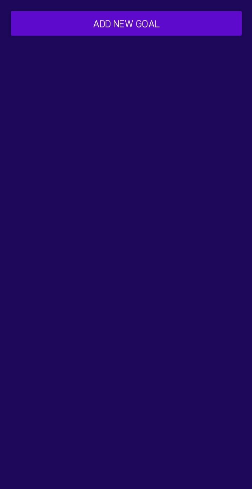
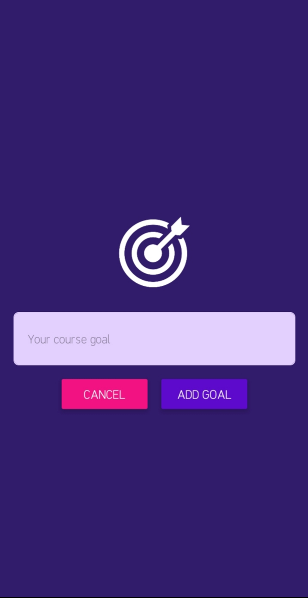
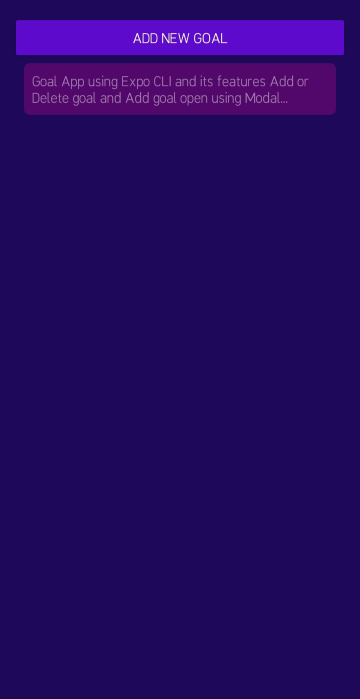

## Goal App

### Learned from : [Maximilian Schwarzmüller](https://www.udemy.com/course/react-native-the-practical-guide/)

## Images

## Run Locally

- Run this command `git clone https://github.com/aliaftabsheikh/Goal-App.git`
- You are now in the dev environment and you can play around

## Tech Stack

- REACT NATIVE
- CSS3
- Javascript
- React js
- Expo CLI
